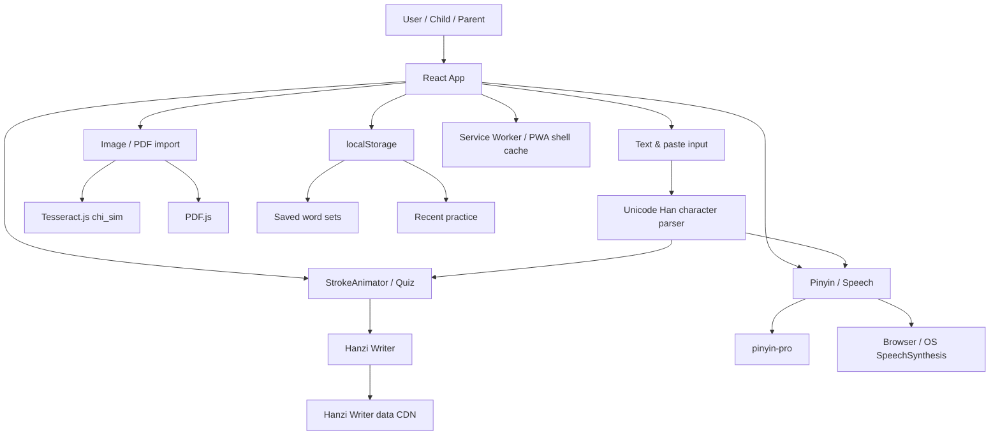
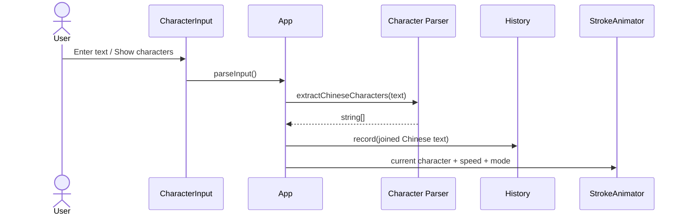
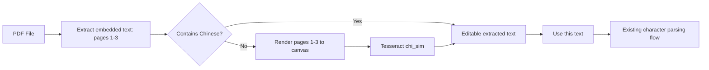

# Hanzi Steps アプリケーション仕様書

## 1. 文書情報

| 項目 | 内容 |
|---|---|
| 文書目的 | 継続開発を担当するエンジニア向けの機能・技術・運用引継ぎ |
| 対象アプリ | Hanzi Steps / Chinese Stroke Order Practice |
| 文書基準日 | 2026-07-13（Asia/Singapore） |
| 基準コミット | `5fd9240` |
| package version | `0.3.0` |
| リポジトリ | `https://github.com/masp314/chinese-stroke-order` |
| 公開URL | `https://masp314.github.io/chinese-stroke-order/` |
| ステータス表記 | 実装済み / 一部実装 / 未実装 / 将来候補 |

本書は現行コードを基準とする。将来コードと本書に差異が生じた場合は、実装コードとGit履歴を正とし、本書も同じ変更で更新すること。

---

## 2. プロダクト概要

### 2.1 目的

中国語を学ぶ子どもが、単語または短文を入力し、次の学習を1つのWebアプリ内で行えるようにする。

- 漢字の筆順アニメーションを見る
- 画面上で正しい筆順をなぞる
- ピンインを確認・修正する
- 中国語音声を聞く
- 学習語句を端末内へ保存する
- 最近使った語句を再利用する
- 画像またはPDFから候補テキストを取り込む

### 2.2 現在のプロダクト方針

- ローカルファースト
- バックエンドなし
- ログインなし
- 子ども向けの大きな文字・ボタン・柔らかい配色
- デスクトップ、タブレット、Android Chromeを主な対象とする
- PWAとしてホーム画面へインストール可能
- データは原則としてブラウザ内に保持する

### 2.3 現在のスコープ外

- Firebase、Googleログイン、クラウド同期
- 独自バックエンド、データベース
- Android/iOSネイティブラッパー
- PDF出力
- 手書き採点・スコアリング
- 教師・保護者用管理画面
- 学習進捗分析
- 完全オフラインの筆順・OCRデータ同梱

---

## 3. 対象ユーザーと利用環境

### 3.1 主な利用者

- 中国語初学者の子ども
- 子どもの学習を補助する保護者
- 教材やワークシートから練習語句を準備する教師・保護者

### 3.2 想定環境

| 環境 | 状態 | 備考 |
|---|---|---|
| Desktop Chrome | 対象 | 開発・確認の基準環境 |
| Android Chrome | 対象 | PWAインストール、カメラ/ファイル選択、TTSに端末差あり |
| iPhone Safari/PWA | 一部対象 | Web Speech API、PWA更新、ファイル処理にSafari固有制約があり得る |
| Tablet browser | 対象 | 720px以下でモバイルレイアウト |
| Firefox | 未保証 | 基本機能は動作する可能性があるが、PWA/TTSは要確認 |
| 古いブラウザ | 対象外 | Unicode property escape、ResizeObserver、createImageBitmap等を利用 |

---

## 4. 画面構成

アプリはルーティングを持たない1ページ構成である。上から次の順に表示する。

1. ヘッダー（Hanzi Steps、`升` アイコン）
2. STEP 1: 中国語入力
3. Advanced: 画像/PDFインポート
4. STEP 2: 筆順アニメーション / Quiz
5. LISTEN & SAY: ピンイン・音声
6. MY WORD SETS: 保存語句セット
7. RECENT PRACTICE: 履歴
8. フッター

右上のハンバーガーメニューから各セクションのアンカーへ移動できる。

初期入力値は次の文章である。

```text
你好，我喜欢学中文
```

解析後の初期文字列は次の8文字となる。

```text
你 好 我 喜 欢 学 中 文
```

---

## 5. 機能仕様

## 5.1 テキスト入力・文字解析

ステータス: **実装済み**

### 入力方法

- STEP 1のtextareaへ直接入力
- `Ctrl+Enter` または `Cmd+Enter` で解析
- `Show characters` ボタンで解析
- 貼り付けリストから読み込み
- 保存語句セットから読み込み
- 履歴から読み込み
- 画像/PDF抽出結果から読み込み

### 入力制約

- 直接入力textareaは `maxLength=80`
- プログラム経由の読み込みには同じ80文字制限は強制されない
- 空白、英字、数字、句読点は漢字リストから除外する
- Unicode正規表現 `\p{Unified_Ideograph}` に一致する文字だけを抽出する
- 拡張面の漢字もUTF-16の2要素ではなく1文字として扱う

### 解析時の副作用

- 再生中のアニメーションを停止
- 現在位置を先頭へ戻す
- 音声選択文字を先頭1文字へ戻す
- 手動ピンイン指定を、ロード元に応じて設定または解除
- 中国語が1文字以上あれば履歴へ記録
- 中国語がなければエラーメッセージを表示

### 既知の仕様

- 単語間の空白、句読点、改行は `characters.join('')` の時点で失われる
- 下流のピンインと全文TTSは、原文ではなく結合済みの中国語文字列を使用する
- そのため、TTSでは原文の句読点による間が反映されない

---

## 5.2 貼り付けリスト

ステータス: **実装済み**

- STEP 1内の `Paste / import a word list` で開閉
- 番号、英語説明、空白、改行を含むテキストを貼り付け可能
- 確定後は通常の文字解析フローへ渡す
- 貼り付け内容そのものの構造は保存せず、中国語文字だけが下流で使用される

例:

```text
1. 农夫
2. 羊毛
3. 又长又卷
```

解析結果:

```text
农 夫 羊 毛 又 长 又 卷
```

---

## 5.3 筆順アニメーション

ステータス: **実装済み**

### 表示

- 現在の漢字を正方形の田字格風ガイド内へ表示
- Hanzi Writerを使用
- 文字本体、アウトライン、部首色を表示
- `ResizeObserver` でAndroidを含むレスポンシブ表示に追従
- 文字一覧を下部に表示し、現在文字を強調

### 操作

- Previous
- Next
- Play / Replay
- Play all
- Stop & reset
- Slow / Normal / Fast
- 文字一覧から直接選択

### 速度設定

| 設定 | strokeAnimationSpeed | delayBetweenStrokes |
|---|---:|---:|
| Slow | 0.55 | 650ms |
| Normal | 1.0 | 350ms |
| Fast | 1.8 | 140ms |

### Play all

- 先頭から順に現在インデックスを変更
- ReactによるWriter再生成待ちとして固定650ms待機
- 1文字再生後に固定300ms待機
- `runIdRef` によって停止・別操作時のループを無効化
- 未対応文字はWriterの失敗を返し、アプリ自体はクラッシュしない

### 未対応文字

- `Stroke data not found for this character.` を表示
- 現在文字の再生とQuizを無効化
- Play allはループ自体を停止せず、次の文字へ進む設計

### 既知の技術課題

- Play allのロード待ちはイベント駆動ではなく固定650ms
- 遅いネットワークではWriterのロード完了前に再生要求される可能性がある
- 完全なキャンセルAPIではなくgeneration/run IDで古い処理を無効化している

---

## 5.4 Quiz / なぞり書き

ステータス: **実装済み**

- Watch mode / Quiz modeをタブ切替
- Quiz modeでは見本文字を非表示にしてHanzi Writer quizを開始
- Start quiz
- Reset quiz
- Previous / Next
- 2回間違えるとヒントを表示
- 完了時に正しい文字をハイライト
- Hanzi Writerのストローク一致判定を利用

### 現在提供しないもの

- 点数
- 学習履歴への正誤保存
- 書字品質評価
- 保護者向けレポート
- 手書きデータの永続保存

---

## 5.5 ピンイン

ステータス: **実装済み**

- `pinyin-pro` を使用
- 声調記号付きピンインを生成
- 全文の下に表示
- 現在文字のピンインを文字選択欄に表示
- 全文ピンインは編集可能
- `Use automatic pinyin` で自動生成へ戻せる
- 手動ピンインは保存語句セットと一緒に保存可能

### 既知の仕様

- 手動ピンインは現在入力全体に対する1つの文字列
- 文字単位の発音辞書や多音字ルールは持たない
- 保存していない手動ピンインはリロードで失われる
- 履歴にはピンインを保存しない

---

## 5.6 Text-to-Speech

ステータス: **実装済み**

### API

- Browser Web Speech API `speechSynthesis`
- 外部有料APIは使用しない
- 読み上げるのは中国語文字列であり、ピンインではない

### 読み上げ対象

1. 全文
2. 現在の1文字
3. ユーザーが複数選択した文字

### 音声速度

| 設定 | rate |
|---|---:|
| Slow | 0.55 |
| Normal | 0.78 |
| Fast | 1.0 |

### 音声選択ポリシー

- 中国本土普通話を既定とする
- Googleの `zh-CN` / `cmn-CN` 音声を最優先
- その他の中国本土普通話を次候補
- 香港音声 `zh-HK` / `yue-HK` は手動選択として表示
- 台湾音声 `zh-TW` / `cmn-TW` は候補から除外
- Androidで音声一覧が空でも `utterance.lang = 'zh-CN'` でシステム音声へフォールバック

### 既知の制約

- 音質と発音はブラウザ・OS・インストール済み音声に依存
- アプリからGoogle音声を端末へインストールできない
- Android/iOSで利用可能音声名と言語タグが異なる
- 音声が利用できない場合は警告し、クラッシュしない
- 下流では句読点を除去した `chineseText` を使うため、全文の間が不自然になり得る

---

## 5.7 保存語句セット

ステータス: **実装済み**

### 操作

- タイトルを付けて現在入力を保存
- 保存セット一覧を表示
- Load
- Delete
- タイトル候補を表示

### タイトル候補

- `Practice DD Mon YYYY`
- 現在入力の先頭16文字
- `Practice HH:mm`

### 保存場所

- `localStorage`
- キー: `hanzi-steps.saved-word-sets.v1`

### データ構造

```ts
interface SavedWordSet {
  id: string
  title: string
  text: string
  createdAt: string
  pinyin?: string
}
```

### 既知の仕様

- 同じタイトル・本文の重複保存を許可
- 並び順は新規保存順
- 上限件数なし
- データ容量はブラウザのlocalStorage上限に依存
- 端末・ブラウザ・プロファイル間で同期しない
- ブラウザデータ削除で消失
- エクスポート・バックアップ機能なし

---

## 5.8 履歴

ステータス: **実装済み**

### 記録タイミング

- テキストを解析・ロードしたとき
- 現在文字を再生したとき
- Play allを開始したとき

### 保存仕様

- `localStorage`
- キー: `hanzi-steps.history.v1`
- 最新30件
- 同一文字列は重複させず、最新利用時に先頭へ移動
- Clear historyで全削除
- クリックで現在入力へロード

### データ構造

```ts
interface HistoryItem {
  text: string
  lastUsedAt: string
}
```

### 既知の仕様

- 履歴本文は抽出済み中国語文字の連結値
- 原文の空白、句読点、改行は保存しない
- ピンインoverrideは保存しない
- localStorage書込失敗は学習を妨げないよう黙って無視する

---

## 5.9 画像インポート / OCR

ステータス: **一部実装**

OCRは便利機能であり、精度保証された入力手段ではない。必ず編集可能な確認画面を経由する。

### 対応ファイル

- PNG
- JPG / JPEG
- WebP

### OCRエンジン

- Tesseract.js
- 言語: `chi_sim`
- ブラウザ内処理
- 画像をアプリ独自サーバーへ送信しない
- Worker、WASM、言語データの取得先はTesseract.js既定設定を使用
- 初回OCRではネットワークが必要になり得る

### 画像モード

| モード | 処理 |
|---|---|
| Auto detect | 文書OCRを先に実行し、信頼度・中国語数・行数のヒューリスティックで短文OCRを再試行 |
| Word / short phrase | 1〜10文字程度の横1行を対象。前処理後に `PSM.SINGLE_LINE` |
| Worksheet / full page | 元画像を `PSM.AUTO` で文書OCR |

### Short phrase前処理

1. `createImageBitmap` で画像を読込
2. 最大辺1800pxへ縮小
3. グレースケール化
4. 積分画像を用いた局所適応型二値化
5. 周囲平均との差28以上暗い画素をinkと判定
6. 横方向のink分布から主テキスト帯を1つ選択
7. 列方向のink範囲を算出
8. パディングを追加
9. 1600×700 canvasへ拡大配置
10. Tesseractへ渡す
11. 実際にOCRへ渡した画像をプレビュー表示

### テキスト後処理

- 改行コード正規化
- BOM除去
- 行頭の一般的な数字番号を除去
- 連続空白を整理
- 過剰な空行を整理
- Short phraseでは行頭の `人.`、`一.`、`I.`、`l.` 等、`1.` の典型的誤認識を除去
- 中国語以外を一律削除せず、編集欄へ残す

### 現在確認されているOCR課題

- 画面をカメラ撮影したモアレ画像で誤認識が発生
- `想` を `四` と認識した実例がある
- 複数の番号付き語句を1行として渡すと、内部番号が残る場合がある
- `四` も有効な漢字なので、一般的な置換ルールでは安全に修正できない
- Short phraseは主テキスト帯を1つだけ選ぶため、画像内の他の行を意図的に捨てる
- WorksheetはShort phrase用の照明補正・帯分割を使わない
- OCR精度の定量評価は未実施

### 推奨運用

- 可能なら選択可能なテキストPDFを優先
- 画像は正面、明るい場所、高解像度、文字を大きく撮影
- 抽出結果を必ず確認・修正してから `Use this text & show characters`

---

## 5.10 PDFインポート

ステータス: **一部実装**

### 対応方式

1. PDF.js (`pdfjs-dist`) でPDFを開く
2. 先頭最大3ページの埋め込みテキストを抽出
3. 中国語が1文字でも含まれていれば、埋め込みテキストを採用
4. 中国語がなければ、先頭最大3ページをcanvasへ描画
5. 描画結果をTesseract.js `chi_sim` でOCR

### PDFレンダリング

- 初期viewportを基準にscaleを算出
- 最大辺が概ね2200px以内
- PDF workerはViteの `?url` importでビルド成果物へ同梱

### 長いPDF

- 3ページを超える場合は警告
- ページ選択UIなし
- 4ページ目以降は処理しない

### 既知の制約

- 一部ページだけテキスト、一部ページが画像の場合でも、先頭3ページ内に中国語テキストが1文字あればOCRへフォールバックしない
- PDFの複雑な段組み、表、縦書きは読み順が崩れる可能性がある
- 選択可能なPDFでもToUnicode情報が壊れていれば文字化けし得る
- スキャンPDFのOCR精度は画像OCRと同じ制約を持つ
- パスワード保護PDFへの専用UIなし
- 処理キャンセル機能なし

---

## 5.11 PWA

ステータス: **実装済み（app shell中心）**

### Manifest

| 項目 | 値 |
|---|---|
| name | Chinese Stroke Order Practice |
| short_name | Stroke Order |
| display | standalone |
| orientation | any |
| theme_color | `#ef7f6d` |
| background_color | `#fff9f0` |
| icon | `升`、192px / 512px |

### Service Worker

- production build時のみ登録
- 現行キャッシュ名: `stroke-order-shell-v14`
- install時にbase URL、manifest、192/512アイコンをキャッシュ
- activate時に旧キャッシュを削除
- navigationはオンライン時network-first、失敗時app shellへフォールバック
- 同一originの静的assetはcache-first、未キャッシュ時に取得して保存
- 外部originのリクエストはService Workerの対象外

### 完全オフラインではない理由

- Hanzi Writerの文字データは既定CDNから取得
- Tesseract.jsの言語データ等は既定の外部取得に依存
- Web Speech APIの音声は端末・OSに依存
- 初回利用したことのない漢字やOCRはオフラインで失敗し得る

### 更新上の注意

- Service Workerの動作を変えるリリースでは `CACHE_NAME` を更新する
- Android/iOSのホーム画面アイコンはOSキャッシュに残る場合があり、再インストールが必要なことがある
- navigationをnetwork-firstへ変更済みだが、インストール済みPWAの更新確認は端末差がある

---

## 5.12 UI・アクセシビリティ

ステータス: **一部実装**

### 実装済み

- 大きなボタン
- 720px以下のモバイルレイアウト
- 現在文字の明確なハイライト
- 柔らかいコーラル、ティール、クリーム系配色
- セクションアンカーメニュー
- `aria-label`、`aria-live`、`role=status/alert` の一部実装
- キーボードfocusスタイル
- タッチ操作可能なボタンサイズ

### 未確認・未実装

- WCAG準拠監査
- スクリーンリーダーによる実機試験
- 色覚多様性試験
- キーボードのみの全操作試験
- UI言語切替
- 日本語UI・中国語UI
- ダークモード

---

## 6. システム構成



### 6.1 技術スタック

| 分類 | 技術 |
|---|---|
| UI | React 19 + TypeScript |
| Build | Vite 7 |
| 筆順 | hanzi-writer 3.7 |
| ピンイン | pinyin-pro 3.28 |
| OCR | tesseract.js 6.0 |
| PDF | pdfjs-dist 5.4 |
| 保存 | Browser localStorage |
| 音声 | Web Speech API |
| PWA | Web App Manifest + custom Service Worker |
| CI/CD | GitHub Actions + GitHub Pages |
| Lint | ESLint 9 + typescript-eslint |

### 6.2 コンポーネント責務

| ファイル | 責務 |
|---|---|
| `src/App.tsx` | 全体状態、各機能の統合、Play all制御 |
| `CharacterInput.tsx` | 直接入力、貼り付けリスト |
| `FileImportPanel.tsx` | ファイル選択、進捗、OCR結果編集、確認 |
| `StrokeAnimator.tsx` | Hanzi Writer生成、再生、Quiz、resize、エラー境界 |
| `CharacterList.tsx` | 文字一覧と現在文字選択 |
| `Controls.tsx` | Watch mode操作 |
| `QuizControls.tsx` | Quiz mode操作 |
| `PronunciationPanel.tsx` | ピンイン編集、音声選択、読み上げUI |
| `SavedWordSets.tsx` | 保存セットUI |
| `HistoryPanel.tsx` | 履歴UI |
| `SectionMenu.tsx` | 1ページ内アンカーナビゲーション |

### 6.3 Hook / Service / Utility責務

| ファイル | 責務 |
|---|---|
| `useSavedWordSets.ts` | 保存語句セットのlocalStorage読書き |
| `useHistory.ts` | 履歴の重複排除・30件制限・localStorage読書き |
| `useSpeech.ts` | 音声列挙、地域フィルタ、優先順位、読み上げ |
| `characterData.ts` | 筆順データ取得の抽象化境界 |
| `characters.ts` | 中国語文字抽出 |
| `pinyin.ts` | pinyin-pro wrapper |
| `importText.ts` | 画像前処理、OCR、PDF抽出、テキスト清掃 |

---

## 7. 状態管理

外部状態管理ライブラリは使用せず、React `useState` / `useMemo` / `useRef` とcustom hooksを使用する。

### App主要状態

| State | 内容 |
|---|---|
| `input` | STEP 1の原入力 |
| `characters` | 抽出済み漢字配列 |
| `currentIndex` | 現在文字位置 |
| `speed` | 筆順速度 |
| `mode` | watch / quiz |
| `playbackState` | idle/loading/playing/quizzing/unsupported |
| `isPlayingAll` | Play all進行中 |
| `pinyinOverride` | 手動ピンイン。undefinedなら自動 |
| `speechSpeed` | TTS速度 |
| `speechSelection` | 複数読み上げ対象インデックス |

### 永続化されない状態

- 現在入力
- 現在文字位置
- Watch / Quiz mode
- アニメーション速度
- TTS速度
- 選択音声
- OCR編集中テキスト・画像プレビュー

ページ再読み込みで初期値へ戻る。

---

## 8. データフロー

### 8.1 通常入力



### 8.2 PDF入力



---

## 9. 外部通信とプライバシー

### 9.1 外部通信

| 通信 | 目的 | 現在の扱い |
|---|---|---|
| GitHub Pages | アプリ配信 | 必須 |
| Hanzi Writer既定CDN | 筆順文字データ | 必要時取得 |
| Tesseract.js既定配信元 | Worker/WASM/chi_simデータ | 初回OCR等で必要になり得る |
| 端末音声サービス | TTS | OS/ブラウザ実装依存 |

### 9.2 ユーザーデータ

- 入力語句、履歴、保存セットはアプリ独自サーバーへ送信しない
- 画像・PDFはブラウザ内で処理する
- 画像・PDF自体をlocalStorageへ保存しない
- Webファイル入力からカメラ撮影した画像はAndroid側でギャラリー保存されない場合がある
- OCR用プレビューはReact state上のdata URLであり、リロードで消える

### 9.3 現在未実装のセキュリティ項目

- Content Security Policy
- Subresource Integrity
- 依存関係更新ポリシー
- ファイルサイズ上限
- OCR/PDF処理の明示的なメモリ上限
- 悪意あるPDFに対する独自サンドボックス
- プライバシーポリシー画面

PDF.js/Tesseract.jsの脆弱性情報と依存更新は継続監視が必要。

---

## 10. ビルド・開発・公開

### 10.1 必要環境

- Node.js 20.19+ または22.12+
- npm
- GitHub公開にはGit、GitHub CLI (`gh`)、対象アカウント認証

### 10.2 ローカル起動

```bash
cd /Users/hiroakimasuda/Documents/Codex/2026-07-06/cod
npm install
npm run dev
```

LAN内のスマホから開く場合:

```bash
npm run dev -- --host 0.0.0.0
```

macOSのIPアドレスとVite表示ポートを用いてアクセスする。macOS Firewall、同一Wi-Fi、VPN等の影響を受ける。

### 10.3 品質確認コマンド

```bash
npm run lint
npm run build
npm run preview
```

### 10.4 GitHub Pages

- `main` pushで `.github/workflows/deploy-pages.yml` を実行
- Node.js 22
- `npm ci`
- `VITE_BASE_PATH=/chinese-stroke-order/`
- `dist/` をPages artifactとしてデプロイ

### 10.5 公開補助スクリプト

```bash
bash scripts/publish-github.sh
```

このスクリプトは次を実行する。

- `gh auth status` 確認
- Git user情報の不足時設定
- 全変更をstage
- 変更があれば固定メッセージでcommit
- remoteを `masp314/chinese-stroke-order` に設定
- `main` をpush

注意: lint/buildはpublishスクリプト内では実行しない。公開前に手動で実行すること。

---

## 11. テスト仕様

### 11.1 現在の自動テスト状況

ステータス: **未実装**

- Unit testなし
- Component testなし
- E2E testなし
- Visual regression testなし
- CIで実行されるのは依存導入とproduction buildのみ
- ESLintはGitHub Actionsでは実行していない

### 11.2 最低限のリリース前手動確認

1. 初期文章が `你好，我喜欢学中文`
2. 入力から中国語だけが正しい順序で抽出される
3. Previous / Next / Replay
4. Play all
5. Slow / Normal / Fast
6. 未対応文字でクラッシュしない
7. Quiz開始・リセット・文字移動
8. ピンイン自動生成
9. ピンインoverride保存・再ロード
10. 中国本土普通話TTS
11. 香港音声が存在する端末で手動選択
12. Saved set保存・ロード・削除
13. History追加・重複排除・30件制限・削除
14. 画像Short phrase OCRとプレビュー
15. Worksheet OCR
16. テキストPDF抽出
17. スキャンPDF OCR fallback
18. 3ページ超PDFの警告
19. Android Chrome responsive表示
20. PWA installと更新
21. `升` アイコン

### 11.3 優先して追加すべき自動テスト

優先度P0:

- `extractChineseCharacters`
- `cleanExtractedText`
- Short phrase番号誤認識除去
- Historyの重複排除・30件制限
- SavedWordSetの保存・読込validation
- TTS音声地域フィルタ

優先度P1:

- App入力から各下流状態へのintegration test
- Play allのcancel動作
- unsupported character
- PDF embedded text / OCR fallback分岐
- Service Workerのnavigation fallback

---

## 12. 実装状況一覧

| 機能 | 状態 | 備考 |
|---|---|---|
| 中国語入力 | 実装済み | 直接入力80文字上限 |
| 漢字抽出 | 実装済み | Unified Ideograph |
| 文字一覧・現在文字 | 実装済み | クリック選択 |
| 筆順アニメーション | 実装済み | Hanzi Writer |
| Play all | 実装済み | 固定待機時間あり |
| 速度変更 | 実装済み | 3段階 |
| Quiz | 実装済み | 採点保存なし |
| Pinyin | 実装済み | pinyin-pro |
| Pinyin override | 実装済み | Saved setへ保存可能 |
| TTS | 実装済み | Web Speech API |
| 中国本土音声優先 | 実装済み | 香港は手動、台湾除外 |
| Saved word sets | 実装済み | localStorage |
| History | 実装済み | localStorage、30件 |
| 貼り付けリスト | 実装済み | 構造は保持しない |
| 画像OCR | 一部実装 | 精度保証なし |
| PDF embedded text | 実装済み | 先頭3ページ |
| PDF OCR fallback | 一部実装 | 先頭3ページ |
| PWA install | 実装済み | app shell中心 |
| 完全オフライン | 未実装 | 筆順/OCR外部データ依存 |
| クラウド同期 | 未実装 | バックエンドなし |
| ログイン | 未実装 | 意図的に対象外 |
| データexport/import | 未実装 | Saved/history backupなし |
| ネイティブアプリ | 未実装 | PWAのみ |
| OCR精度評価 | 未実装 | 代表画像セット未整備 |
| 自動テスト | 未実装 | lint/buildのみ |
| UI多言語化 | 未実装 | 現在UIは英語 |

---

## 13. 既知の技術的負債

### P0: 継続開発前に対処推奨

1. 自動テスト基盤がない
2. `App.tsx` が複数ドメイン状態を一括管理している
3. OCR精度の定量評価データがない
4. publishスクリプトがlint/buildを実行しない
5. CIがlint/testを実行しない

### P1: 機能品質に影響

1. Play allが固定待機時間
2. 原文の句読点・単語境界を下流で失う
3. 履歴にpinyin overrideを保存しない
4. Saved set件数上限・重複管理がない
5. OCR/PDF処理のcancelがない
6. ファイルサイズ制限がない
7. PDFの混在ページ判定が粗い
8. Short phraseが主テキスト帯1つのみ
9. TTS音声選択を永続化しない
10. Service Workerが手書きで、更新通知UIがない

### P2: 保守性

1. Storage accessがhook内に直接実装されている
2. OCR前処理・PDF・Tesseract制御が1ファイルに集中
3. Errorの分類コードがなく、UI文言が文字列判定に依存
4. UI文言がコンポーネントへハードコード
5. package versionとプロダクトリリースの対応ルールがない

---

## 14. 将来拡張方針

## 14.1 推奨ロードマップ

### Phase A: 品質基盤

- Vitest + React Testing Library導入
- Playwrightによる主要E2E
- CIへlint/test追加
- 入力原文と漢字配列を分離したドメインモデル
- Error codeとユーザー文言の分離
- リリース番号・CHANGELOG導入

### Phase B: OCR改善

- 実教材20〜30枚以上の評価セット作成
- Character Error Rate、修正時間を測定
- 番号付き項目ごとの領域分割
- 元画像、グレースケール、二値画像のmulti-pass OCR
- confidence比較
- ページ/領域選択UI
- 処理キャンセル
- 画像回転・deskew
- EXIF orientationの明示対応
- Worksheetにも局所照明補正を選択適用
- Tesseract.jsで不足する場合は、より強いローカルOCRまたは任意クラウドOCRを別adapterで検討

### Phase C: オフライン強化

- Hanzi Writerデータの必要文字分bundling
- Tesseract worker/core/chi_simのself-host
- Workbox等を検討したcache戦略整理
- Offline/Online状態表示
- OCR言語データ準備状況表示

### Phase D: データ可搬性

- Saved sets/historyのJSON export/import
- schema versionとmigration
- 端末内バックアップ
- optional cloud syncの前段となるrepository interface

### Phase E: optional cloud

ユーザー承認後にのみ検討する。

- 認証provider
- user-scoped database
- local-first sync queue
- conflict resolution
- offline mutation replay
- delete/account data handling
- privacy policy / retention policy

現時点ではFirebase/Google loginを導入しない。

---

## 14.2 拡張ポイント

### 筆順データ

`src/services/characterData.ts` が取得境界である。完全オフライン化する場合は、この関数をローカルasset lookupへ差し替える。UI側は変更不要とする設計。

### Storage

現在はhooksがlocalStorageへ直接アクセスする。将来は次のinterfaceを導入する。

```ts
interface WordSetRepository {
  list(): Promise<SavedWordSet[]>
  save(item: SavedWordSet): Promise<void>
  remove(id: string): Promise<void>
}
```

localStorage版とcloud版を差し替えられるようにする。

### OCR

次の責務へ分割することを推奨する。

- `imagePreprocessor`
- `ocrEngine`
- `pdfTextExtractor`
- `pdfPageRenderer`
- `extractionPostProcessor`

クラウドOCRを追加する場合も `ocrEngine` adapterとして実装し、ローカルOCRを維持する。

### TTS

現在はWeb Speech API固定。将来外部音声を導入する場合でも、読み上げ対象文字列とvoice providerを分離し、無料ローカル音声を残す。

---

## 15. データ移行方針

現在のstorage keyはversion suffixを持つ。

- `hanzi-steps.saved-word-sets.v1`
- `hanzi-steps.history.v1`

schema変更時は既存keyを破壊的に上書きせず、次を行う。

1. v1を読み込む
2. validation
3. v2へ変換
4. v2 keyへ保存
5. 移行成功後も一定期間v1を残す
6. rollback方針を用意

クラウド同期導入前に、各recordへ `updatedAt`、`deletedAt`、`schemaVersion` を追加することを推奨する。

---

## 16. エンジニア向け開始手順

### 最初の30分

```bash
git clone https://github.com/masp314/chinese-stroke-order.git
cd chinese-stroke-order
npm ci
npm run lint
npm run build
npm run dev
```

次に以下を確認する。

1. `src/App.tsx` で全体データフローを把握
2. `src/components/StrokeAnimator.tsx` でHanzi Writer lifecycleを把握
3. `src/utils/importText.ts` でOCR/PDF pipelineを把握
4. `src/hooks/useSpeech.ts` で音声地域ポリシーを把握
5. `public/sw.js` でcache更新戦略を把握

### 最初の変更前

- `npm run lint`
- `npm run build`
- Android Chromeでresponsive確認
- localStorage schemaを変更する場合はmigration設計
- Service Worker assetを変える場合はcache version更新
- PWA iconを変える場合はファイル名versioningも検討

### Pull Requestに含めるべき情報

- 変更目的
- 実装済み/未実装範囲
- 対象ブラウザ
- localStorage/PWA cacheへの影響
- 外部通信への影響
- テスト結果
- Android/iOS固有確認結果
- 既知の制約

---

## 17. 完了条件の基準

新機能は少なくとも次を満たすまで完了扱いにしない。

- 既存の筆順、Quiz、保存、履歴、ピンイン、TTSを壊さない
- unsupported dataやAPI不足でクラッシュしない
- Androidの狭い画面で主要操作が可能
- ユーザーデータの保存先と通信先が明確
- lintとproduction buildが成功
- 関連する自動テスト、または未整備の場合は手動確認結果がある
- 本仕様書の実装状況、既知制約、データ構造を更新

